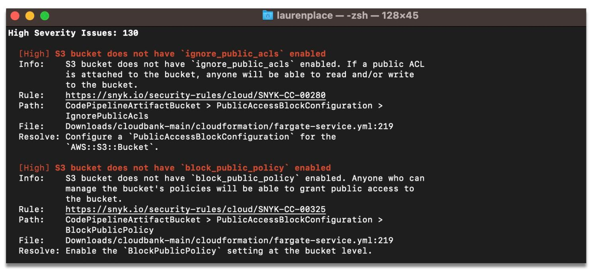

---
title: 'Automatic Source Locations with Rego'
author: 'Jasper Van der Jeugt'
...

# Introduction

At Snyk, we are big fans of [Open Policy Agent]'s Rego.
Our [IaC product] is built around a large set of rules written in Rego,
and customers can add their [own custom rules] as well.

[Open Policy Agent]: https://www.openpolicyagent.org/
[IaC product]: https://snyk.io/product/infrastructure-as-code-security/
[own custom rules]: https://docs.snyk.io/scan-infrastructure/build-your-own-custom-rules/build-your-own-iac+-to-cloud-custom-rules

We recently released a [whole series of improvements][IaC+] to our IaC product,
and in this blogpost we're taking a technical dive into a particularly
interesting feature: automatic source code locations for rule violations.

[IaC+]: https://snyk.io/blog/announcing-iac-plus-early-access/

When checking IaC files against known issues, the updated `snyk iac test`
command will show accurate file, line and column information for each rule
violation.  This works even for custom rules, without the user doing any work.



In this blogpost, we provide a standalone proof-of-concept of this technique,
but in order to lean more towards a short story than an epic, we'll need to
make some simplifications.  The full implementation of this is available
in our [unified policy engine].

[unified policy engine]: https://github.com/snyk/policy-engine/

Let's start by looking at a CloudFormation example.  While our IaC engine
supports many formats, with a strong focus around Terraform, CloudFormation
is a good subject for this blogpost since we can parse it without too many
dependencies (it's just YAML after all).

~~~{.yaml include="template.yml"}
~~~

We want to ensure no subnets use a CIDR block larger than `/24`.  We can write
a Rego policy to do just that:

~~~{.ruby include="policy.rego"}
~~~

This way, `deny` will produce a set of _denied_ resources.  We won't go into how
Rego works in detail since that's not the goal of this blogpost: if you want to
learn Rego, we recommend the excellent [OPA by Example] course.

[OPA by Example]: https://academy.styra.com/courses/opa-by-example

We can subdivide the problem in two parts:

1.  We'll want to infer that our policy uses the `CidrBlock` attribute
2.  Then, we'll retrieve the source code location for this

Let's start with (2) since it provides a good way to familiarize ourselves with
the code.

# Source Location Retrieval

A source location looks like this:

~~~{.go snippet="main.go"}
type Location
~~~

~~~{.go snippet="main.go"}
func (loc Location) String() string {
~~~

We will also introduce an auxiliary type to represent paths in YAML.  In YAML,
there are two kinds of nested documents: arrays and objects:

```yaml
some_array:
- hello
- world
some_object:
  foo: bar
```

If we wanted to be able to refer to any subdocument, we could use something akin
to JSON paths.  In the example above, `["some_array", 1]` would then point to
`"word"`.  But since we won't support arrays in our proof-of-concept, we can get
by just using an array of strings.

~~~{.go snippet="main.go"}
type Path []string
~~~

One example of a path would be something like:

~~~{.go}
Path{"Resources", "PrivateSubnet", "Properties", "CidrBlock"}
~~~

Now we can provide a convenience type to load YAML and tell us the `Location`
of certain `Path`s.

~~~{.go snippet="main.go"}
type Source
~~~

~~~{.go snippet="main.go"}
func NewSource
~~~

Finding the source location of a `Path` comes down to walking a tree of YAML
nodes:

~~~{.go snippet="main.go"}
func (source *Source) Location
~~~

# Sets and Trees of Paths

With that out of the way, we've reduced the problem from automatically
inferring _source locations_ that are used in a policy to automatically
inferring _attribute paths_.

This is also significant for other reasons -- e.g., Snyk can apply the same
policies to IaC resources as well as resources discovered through cloud scans,
the latter of which don't really have meaningful source locations, but they do
have meaningful attribute paths!

So, we want to define sets of attribute paths.  Since paths are backed by
arrays, we unfortunately can't use something like `map[Path]struct{}` as a set
in Go.

Instead, we will need to store these in a recursive tree.

~~~{.go snippet="main.go"}
type PathTree
~~~

This representation has other advantages: in general, we only care about the
_longest_ paths that a policy uses, since they are more _specific_.
Our example policy is using
`Path{"Resources", "PrivateSubnet", "Properties"}` as well as
`Path{"Resources", "PrivateSubnet", "Properties", "CidrBlock"}`, and we only
care about the latter.

We'll define a recursive method to insert a `Path` into our tree:

~~~{.go snippet="main.go"}
func (tree PathTree) Insert
~~~

...as well as a way to get a list of `Path`s back out.  This does a bit of
unnecessary allocation, but we can live with that.

~~~{.go snippet="main.go"}
func (tree PathTree) List
~~~

We now have a way to nicely store the `Path`s that were used by a policy, and we
have a way to convert those into source locations.

# Static vs Runtime Analysis

The next question is to figure out which `Path`s in a given input are used by
a policy, and then `Insert` those into the tree.

This is not an easy question, as the code may manipulate the input in different
ways before using the paths.  We may need to "look through" user-defined
(e.g. `has_bad_subnet`) as well as built-in functions (e.g. `object.get`), just
to illustrate one of the possible obstacles:

~~~ruby
has_bad_subnet(props) {
	[_, mask] = split(props.CidrBlock, "/")
	to_number(mask) < 24
}

deny[resourceId] {
	resource := input.Resources[resourceId]
	resource.Type == "AWS::EC2::Subnet"
	has_bad_subnet(object.get(resource, "Properties", {}))
}
~~~

Fortunately, we are not alone in this since people have been curious about what
programs do basically since the first program was written.  There are generally
two ways of answering a question like that about a piece of code:

 -  Static analysis: try to answer by looking at the syntax tree, types and
    other static information that we can retrieve from (or add to) the OPA
    interpreter.  The advantage is that we don't even need to run this policy,
    which is great if we don't trust the policy authors.  The downside is that
    static analysis techniques will usually result in some false negatives as
    well as false positives.

 -  Runtime analysis: trace the execution of specific policies, and infer from
    what `Path`s are being used by looking at runtime information.  The downside
    here is that we actually need to run the policy, and adding this analysis
    may slow down policy evaluation.

We tried both approaches but decided to go with the latter, since we found it
much easier to implement reliably that way, and the performance overhead was
negligible.  It's also worth mentioning that this is not a binary choice per se:
you could do a hybrid approach where you combine the two.

OPA provides a [Tracer] interface that can be used to receive events about what
the interpreter is doing.  A common use case for tracers is to send metrics or
debug information to some centralized log.  We will use it for something else,
though 😎.

[Tracer]: https://github.com/open-policy-agent/opa/blob/v0.57.0/topdown/trace.go

~~~{.go snippet="main.go"}
type locationTracer
~~~

~~~{.go snippet="main.go"}
func newLocationTracer() *locationTracer
~~~

~~~{.go snippet="main.go"}
func (tracer *locationTracer) Enabled()
~~~

# Tracing Usage of Terms

Rego is an expressive language.  Even though some desugaring happens to reduce
it to a simpler format for the interpreter, there are still a fair number of
events.

We are only interested in two of them.  We consider a value _used_ if:

1.  It is unified (you can think of this as assigned, we won't go in detail)
    against another expression, e.g.:

    ~~~ruby
    x = input.Foo
    ~~~

    This also covers `==` and `:=`.  Since this is a test that can fail, we
    can state we _used_ the left hand side as well as the right hand side.

2.  It is used as an argument to a built-in function, e.g.:

    ~~~ruby
    regex.match("/24$", input.cidr)
    ~~~

    While Rego borrows some concepts from [lazy languages], arguments to
    built-in functions are always completely grounded before the built-in is
    invoked.  Therefore, we can say we _used_ all arguments supplied to the
    built-in.

3.  It used as a standalone expression, e.g.:

    ~~~ruby
    volume.encrypted
    ~~~

    This is commonly used to evaluate booleans, and check that attributes
    do exists.

[lazy languages]: https://en.wikipedia.org/wiki/Lazy_evaluation

Time to implement this.  We match two events and delegate to a specific function
to make the code a bit more readable:

~~~{.go snippet="main.go"}
func (tracer *locationTracer) Trace
~~~

We'll handle the insertion into our `PathTree` later in an auxiliary function
called `used(*ast.Term)`.  For now, let's mark both the left- and right-hand
side to the unification as used:

~~~{.go snippet="main.go"}
func (tracer *locationTracer) traceUnify
~~~

`event.Plug` is a helper to fill in variables with their actual values.

An `EvalOp` event covers both (2) and (3) mentioned above.  In case of a
built-in function, we will have an array of terms, of which the first element is
the function, and the remaining elements are the arguments.  We can check that
we're dealing with a built-in function by looking in `ast.BuiltinMap`.

The case for a standalone expression is easy.

~~~{.go snippet="main.go"}
func (tracer *locationTracer) traceEval
~~~

# Annotating Terms

When we try to implement `used(*ast.Term)`, the next question poses itself:
given a term, how do we map it to a `Path` in the input?

One option would be to search the input document for matching terms.  But that
would give many false positives: a given string like `"10.0.0.0/24"` may appear
many times in the input!

Instead, we will _annotate_ all terms with their path.  Terms in OPA can contain
some metadata, including the location in the Rego source file.  We can reuse
this field to store an input `Path`.  This is a bit hacky, but with some
squinting we are morally on the right side, since the field is meant to store
locations? `¯\_(ツ)_/¯`

The following snippet illustrates how we want to the annotate the first
few lines of our CloudFormation template:

~~~{.yaml}
Resources:                    # ["Resources"]
  Vpc:                        # ["Resources", "Vpc"]
    Type: AWS::EC2::VPC       # ["Resources", "Vpc", "Type"]
    Properties:               # ["Resources", "Vpc", "Properties"]
      CidrBlock: 10.0.0.0/16  # ["Resources", "Vpc", "Properties", "CidrBlock"]
~~~

`annotate` implements a recursive traversal to determine the `Path` at each
node in the value.  For conciseness, we only support objects and leave sets and
arrays out.

~~~{.go snippet="main.go"}
func annotate(path Path, term *ast.Term)
~~~

With this annotation in place, it's easy to write `used(*ast.Term)`.  The only
thing to keep in mind is that not all values are _annotated_: we only do that
for those coming from the input document, not e.g. literals embedded in the
Rego source code.

~~~{.go snippet="main.go"}
func (tracer *locationTracer) used
~~~

# Wrapping Up

That's it, folks!  We skipped over a lot of details, such as arrays, and how
to apply this to a more complex IaC language like HCL.

In addition to that, we're also marking the `Type` attributes as used, since
we check those in our policy.  This isn't great, and as an alternative we try
to provide a resources-oriented Rego API instead.  But that's beyond the scope
of this blogpost for now.

If you're interested in any of these features or more, we recommend checking out
[snyk/policy-engine] for the core implementation or of course [our updated IaC
product][IaC+] which comes with this and a whole host of other features
including an exhaustive rule bundle.

[snyk/policy-engine]: https://github.com/snyk/policy-engine

What follows is a main function to tie everything together and print out some
debug information.  It's mostly just wrapping up the primitives we defined so
far, and running it on an example.  But let's include it to make this blogpost
function as a reproducible standalone example.

~~~{.go snippet="main.go"}
func infer
~~~

~~~{.go snippet="main.go"}
func main
~~~

The full code for this PoC can be found in
[this repository](https://github.com/jaspervdj-snyk/inferattrs/).
